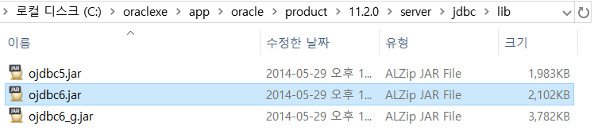
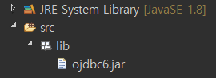
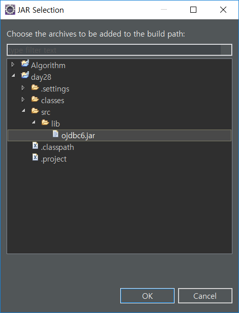
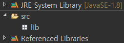

# JDBC 사용


## JAR 파일

##### oracle에서 제공하는 jdbc driver 파일의 위치



> 인터넷에서 다운 받아도 가능


##### jar 파일 넣기

src 밑에 lib 폴더를 놓고 jar파일을 넣으면 나중에 export 시에 같이 나가게 된다.

파일을 옮기고 나서 인식시키기 위해 추가적으로 jar파일을 넣어줘야 한다.



[Properties] > [Java Build Path] > [Libraries] > [Add JARs...]






> 인식 완료 된 후의 모습


## JDBC Programming

driver는 계속 바뀔 수 있기 때문에 정적 방식 생성이 아닌 동적생성 방법으로 사용한다.

1. Reflection API 이용한 JDBC Driver load
   class loader를 통해서 default 생성자를 호출

2. DriverManager 이용한 RDBMS Network 연결

   ```java
   //url (ex. Oracle 사용 시, IP는 변경 가능)
   String url = "jdbc:oracle:thin:@localhost:1521:xe";
   ```
