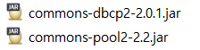
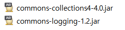

# DBCP (DataBase Connection Pool)

- #### Data Source (데이터 저장소) - Interface

  - 다루어지고 있는 모든 데이터 저장소(각종DB, file 등)를 총 집합한 것. 

  - 각각의 db 접근 방법을 일반화 >> **규격**

  - Sun에서 만들었음.  

- #### DBCP는 Data Source규격에 따라 코드를 구현 + Connection Pooling까지 지원

#### 다운로드

- ##### [DBCP Jar 파일](http://commons.apache.org/proper/commons-dbcp/)

  

- 의존된 파일들

> 나중에는 그냥 Maven으로 하면 된다.
>
> 버전관리는 다운 받으면서 최신화 하기