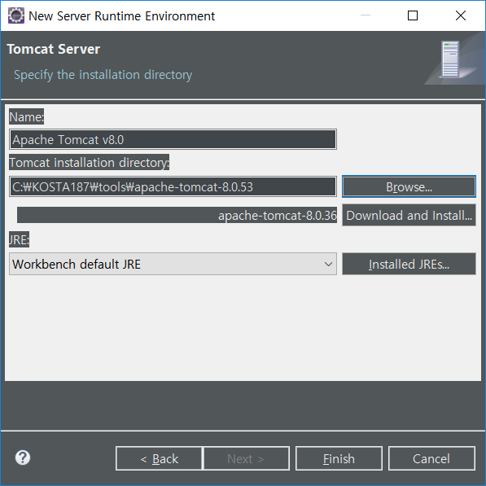
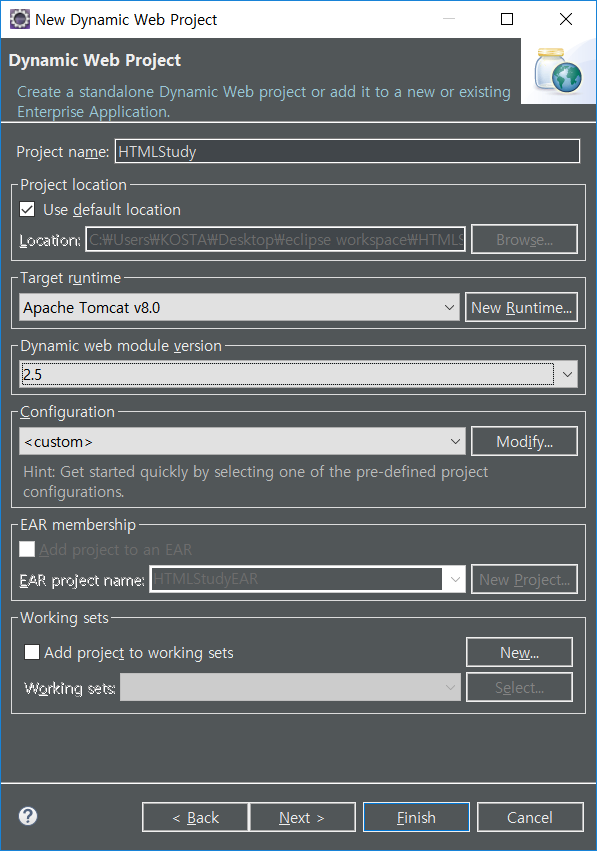
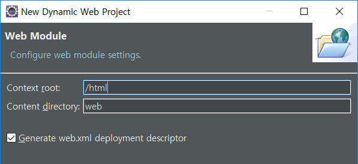
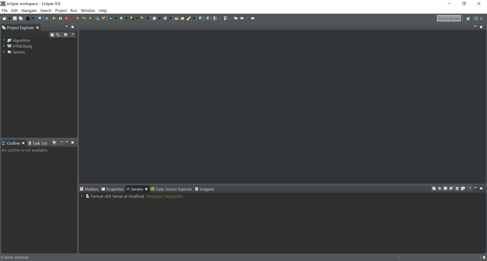

## Apache Tomcat 


#### Port 80으로 변경하기 & 인코딩 설정


##### apache-tomcat-8.0.53/conf/server.xml


```xml
<Connector port="80" protocol="HTTP/1.1"
               connectionTimeout="20000"
               redirectPort="8443" URIEncoding="utf-8"/>
```

> 69 line


```xml
<Connector port="8009" protocol="AJP/1.3" redirectPort="8443" URIEncoding="utf-8"/>
```

> 91 line


##### apache-tomcat-8.0.53/bin/startup.bat

파일을 통해서 tomcat 서버 실행 가능 

shutdown.sh를 통해서 서버 정상적으로 종료 가능(프로그램 서버 종료)


##### 서버 실행시 주소

http://localhost/ 

> / 가 root를 가르킨다

 

##### 서비스되는 default web directory위치

apache-tomcat-8.0.53/webapps/ROOT


#### 가상 사이트 (web site, web application)

내가 원하는 위치에 web application을 만들 수 있다. Directory를 만들 것.

1. **C:/WebContens** 서비스하고자 하는 폴더 생성

2. **apache-tomcat-8.0.53/conf/server.xml** 파일 수정

   ```xml
   <!-- <Host> 안에 써야 한다.--> 
   <Context docBase="C:/WebContens" path = "/hj"/>
   
   <!-- server 재시작-->
   ```

   > docBase : web application 위치
   >
   > path : url 안에서 식별하는 식별자
   >
   > xml에 한글 주석은 안 좋다.


## Eclipse Tomcat 연결

##### Dynamic Web Project 생성


> Target runtime 수정




> apache tomcat 위치 등록




> version은 실습에서 2.5 사용
>
> next 버튼 누르기~




> 원하는 root 이름으로 변경




> 설정 완료