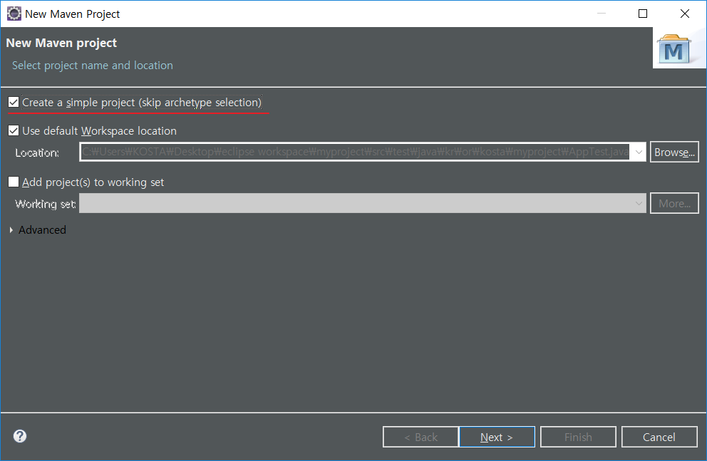

## JUnit 

[JUnit](https://junit.org/junit4/) : 단위 테스트 프레임워크(Container 구조 = Factory를 생성하고 life cyle도 관리), 나중에는 Maven으로 동적 생성 가능

- TestCase 클래스를 상속받아 Test 클래스를 정의하는 방법(JUnit 3)
- Annotation을 사용하여 클래스를 정의하는 방법(JUnit 4) 

> 3버전과 4버전이 같이 있으면 충돌 생김

**현재 [JUnit5](https://junit.org/junit5/)도 있음**

## Log4J

- Log4J는 Multi-Thread 환경에서도 성능에 전혀 영향을 주지 않으면서, 
  안전하게 로그를 기록할 수 있는 환경을 제공한다

- 다양한 출력 대상 지정 가능

  >Console, **File**, Database(?), TCP 서버 등

- 낮은 등급에서 높은 등급으로의 6단계 로그 레벨 별 출력 가능

  > TRACE(test)< DEBUG(개발) < INFO < WARN < ERROR < FATAL

- 환경설정파일(log4j.xml)에  Java package 별로 로그 레벨 설정이 가능하고, 
  설정한 레벨 이상의 로그만 출력 가능하도록 설정 가능

#### Log4J 설정 방법

- 자바 클래스를 이용한 설정
- properties  파일을 이용한 설정
- **XML 파일을 이용한 설정**

## Maven

** 표준화된 프로젝트 관리를 위한 Build 도구.**

> POM(Project Object Model)을 기반으로 프로젝트 산출물에 대한 빌드(컴파일, 패키징) 방법과 테스트 및 배포를 위한 표준화된 생명주기를 정의

**<로컬 repository 위치>**

- **c:/users/{userId}/.m2/repository**

#### 장점

- 모든 프로젝트가 표준화(정형화)된 디렉터리 구조와 빌드 프로세스를 가짐.
  - 전사적으로 표준화된 프로젝트 템플릿을 만들어 배포 가능
  - 필요에 따라 Maven의 다양한 플러그인 사용 가능
- **프로젝트에 필요한 핵심 라이브러리(jar)와 의존 라이브러리의 관리가 편리하다.**

> maven이 현재 JUnit을 3 버전으로default로 잡고 있지만 porn.xml에서 수정 가능

[maven search](https://search.maven.org/), [maven repository](https://mvnrepository.com/)  : GroupId, artifactId, version 검색 및 다운로드 할 수 있는 사이트

#### maven으로 Web project 생성하는 방법

> 추후 관리는 ppt에 써져 있음